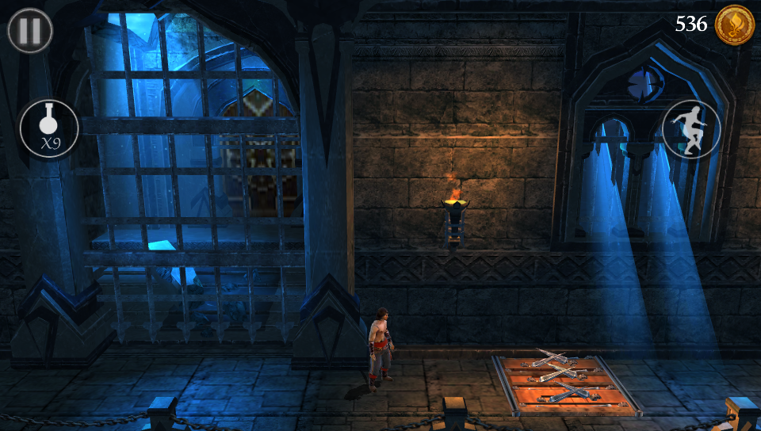

# Prince of Persia 2: The Shadow and the Flame

<p align="center"></p>

This is a wrapper/port of <b>Prince of Persia 2: The Shadow and the Flame</b> for the *PS Vita*.

The port works by loading the official Android ARMv7 executable in memory, resolving its imports with native functions and patching it in order to properly run.
By doing so, it's basically as if we emulate a minimalist Android environment in which we run natively the executable as it is.

## Notes

- The loader has been tested with version 2.0.2 of the game.

## Changelog

### v1.3
- Improve fps
- Also vitaGL improvements, thx Rinnegatamante

### v1.2

- Re-enable MSAA (2x).
- Better PSTV support.
- Fix Simplified Chinese not displaying fonts.

### v1.1

- 60 FPS.
- Fix "Control Settings" screen displaying after prince few steps.

### v1.0

- Initial Release.

## Setup Instructions (For End Users)

- Install [kubridge](https://github.com/TheOfficialFloW/kubridge/releases/) and [FdFix](https://github.com/TheOfficialFloW/FdFix/releases/) by copying `kubridge.skprx` and `fd_fix.skprx` to your taiHEN plugins folder (usually `ux0:tai`) and adding two entries to your `config.txt` under `*KERNEL`:

```
  *KERNEL
  ux0:tai/kubridge.skprx
  ux0:tai/fd_fix.skprx
```

**Note** Don't install fd_fix.skprx if you're using rePatch plugin

- **Optional**: Install [PSVshell](https://github.com/Electry/PSVshell/releases) to overclock your device to 500Mhz.
- Install `libshacccg.suprx`, if you don't have it already, by following [this guide](https://samilops2.gitbook.io/vita-troubleshooting-guide/shader-compiler/extract-libshacccg.suprx).
- Install the vpk from Release tab.
- Obtain your copy of *Prince of Persia 2: The Shadow and the Flame* legally for Android in form of an `.apk`.
- Open the apk with your zip explorer, extract the following files and copy them to `ux0:data/pop2`
  - `libS3DClient.so` from the `lib/armeabi-v7a` folder
  - `S3DMain.smf` from the `assets` folder and rename it to `S3DMain.stk`
- **Chinese users only**: Create `ux0:data/pop2/Fonts` folder and copy [DroidSansFallback.ttf](https://github.com/usineur/pop2-vita/raw/refs/heads/master/DroidSansFallback.ttf) to it.

## Build Instructions (For Developers)

In order to build the loader, you'll need a [vitasdk](https://github.com/vitasdk) build fully compiled with softfp usage (Instructions here: https://github.com/vitasdk-softfp).

Additionally, you'll need these libraries to be compiled as well with `-mfloat-abi=softfp` added to their CFLAGS:

- [libmathneon](https://github.com/Rinnegatamante/math-neon)

  - ```bash
    make install
    ```

- [vitaShaRK](https://github.com/Rinnegatamante/vitaShaRK)

  - ```bash
    make install
    ```

- [kubridge](https://github.com/TheOfficialFloW/kubridge)

  - ```bash
    mkdir build && cd build
    cmake .. && make install
    ```

- [vitaGL](https://github.com/Rinnegatamante/vitaGL)

  - ````bash
    make SOFTFP_ABI=1 NO_DEBUG=1 HAVE_SHADER_CACHE=1 HAVE_GLSL_SUPPORT=1 STORE_DEPTH_STENCIL=1 install
    ````

After all these requirements are met, you can compile the loader with the following commands:

```bash
mkdir build && cd build
cmake .. && make
```

## Credits

- [TheFlow](https://github.com/TheOfficialFlow) for the original .so loader.
- [Rinnegatamante](https://github.com/Rinnegatamante) for his Android ports and especially [Babel](https://github.com/Rinnegatamante/babel-vita) one on which mine is mostly based.
